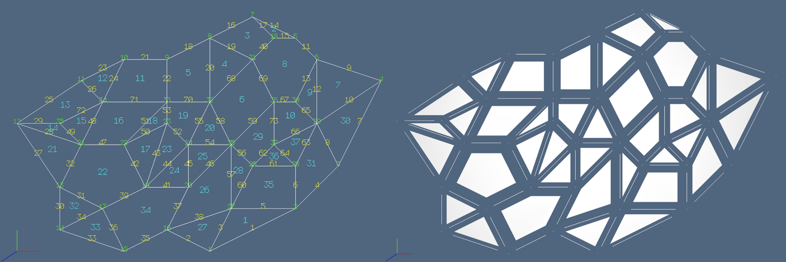

# Graphic text

A standard model for vector graphics was established by the GKS (Graphical Kernel System) ISO standard, very diffused in years 80' and 90' on personal computers and UNIX workstations. Later, it evolved into vector imaging on the web, soon normalized as SVG (Scalable Vector Graphics) W3C standard. In this package we provide a vector `text`  primitive, where any textual string is transformed, using the LAR scheme, into a 1D cellular complex embedded either in 2D or in 3D. Such approach allows for immediate annotation of models with information useful to the development and testing of complex geometric algorithms, and in particular of the Boolean operations. 

The used vector font, originally designed and implemented in PLaSM language (a geometric extension of Backus' FL) for the book [Geometric Programming for Computer-Aided Design](https://onlinelibrary.wiley.com/doi/book/10.1002/0470013885) (Wiley, 2003), has been ported to native Julia, by implementing each printable ASCII character (codes 32-126)
as a LAR model, and providing primitives to translate every textual string into one or more such data structures. For example, the "PLaSM" string is transformed into the 1D complex 

```julia
julia> Plasm.text("PLaSM")
# output
([0.0 0.0 3.0 4.0 4.0 3.0 0.0 9.0 5.0 5.0 14.0 13.0 11.0 10.0 10.0 
11.0 13.0 14.0 14.0 14.0 15.0 16.0 18.0 19.0 19.0 18.0 16.0 15.0 15.0 16.0 18.0 19.0 
20.0 20.0 22.0 24.0 24.0; 0.0 6.0 6.0 5.0 3.0 2.0 2.0 0.0 0.0 6.0 1.0 0.0 0.0 1.0 
2.0 3.0 3.0 2.0 0.0 3.0 1.0 0.0 0.0 1.0 2.0 3.0 3.0 4.0 5.0 6.0 6.0 5.0 0.0 6.0 4.0 
6.0 0.0], Array{Int64,1}[[1, 2], [2, 3], [3, 4], [4, 5], [5, 6], [6, 7], [8, 9], 
[9, 10], [11, 12], [12, 13], [13, 14], [14, 15], [15, 16], [16, 17], [17, 18], [18, 11], 
[19, 20], [21, 22], [22, 23], [23, 24], [24, 25], [25, 26], [26, 27], [27, 28], [28, 29], 
[29, 30], [30, 31], [31, 32], [33, 34], [34, 35], [35, 36], [36, 37]])
```


## Vector graphics for model annotations

A developer of geometric models or algorithms may need to annotate her work with textual data, and in particular to annotate the various dimensional cells of a cellular complex with their ordinal number. A 2D example is given in the above Figure. Other examples are given below.


> **Figure 1:** Visualization of a 2D cellular complex, and numbering of its cells with different colors, depending on their dimension. It may be interesting to notice that the topology of the complex is fully specified by the LAR model (V,EV) of vertices and edges.

The geometry of 2D faces can be computed -- as a minimal basis of *cycles* (chains without boundaries) -- by the `arrangement` algorithms given in the companion package `LinearAlgebraicRepresentation.jl`.


## Numbering cellular complexes

To get a proper view of data types used by `LARVIEW` and `LARLIB` packages, look at the
[Glossary](glossary.md) document.


Another set of methods will be dedicated to *display cell indices* of various cell complexes, using different *colors* for each `Cells` object, but it was not yet been ported to *Julia*.


## Examples


> **Figure 2:** Visualization of cellular 2- and 3-complexes generated by 
`LinearAlgebraicRepresentation` package: (a) 2D disk; (b) cylinder surface in 3D; (c) 2-sphere surface in 3D; (3) toroidal surface in 3D.


## Main Interface

```@docs
Plasm.numbering
```
